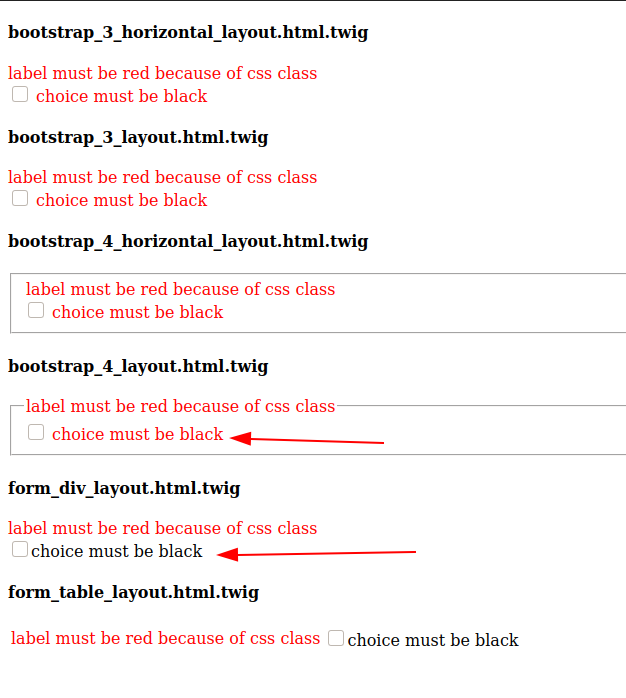

# Maybe a symfony form template bug
Seems to be a bug for some of the form templates for choice field with `expanded` and `multiple` settings set to true.

What I want is to add css class to label of choice class but not the choices. I add `'label_attr' => ['class' => 'red']` as I would to any field. And it actualy 
works if I set `expanded` to false.

It seems all bootstrap templates suffer from same problem but not `div` and `table` layouts.

It this a bug in bootstrap templates?



## App
- Symfony 4.4, but it seems to be the same on 5.* also.
- Twig 2.*

## Setup example and run it and see it for yourself!

```shell
composer install
symfony serve
```

